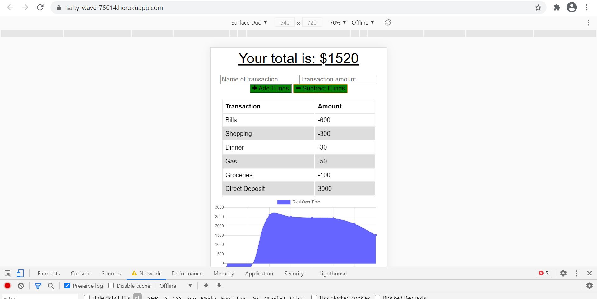

# budget
## Table of Contents
* [Description](#description)
* [Installation](#installation)
* [Usage](#usage)

## Description 
This application allows users to track withdrawals and deposits with or without a data/internet connection so their account balance is accurate when traveling.

 
Online Transactions Image:  
  
  
  
  
 Offline Transaction Image:  
  
  
  
 
 

## Installation
You can view the application on Heroku: https://salty-wave-75014.herokuapp.com/

1. git clone: git@github.com:denisequarles1/budget.git
2. Run npm install
3. Run node server.js to run locally 
 

## Usage 
You will be able to add expenses and deposits to their budget with or without a connection. When entering transactions offline, they should populate the total when brought back online.

Offline Functionality:
* Enter deposits offline
* Enter expenses offline

When brought back online:
* Offline entries should be added to tracker
